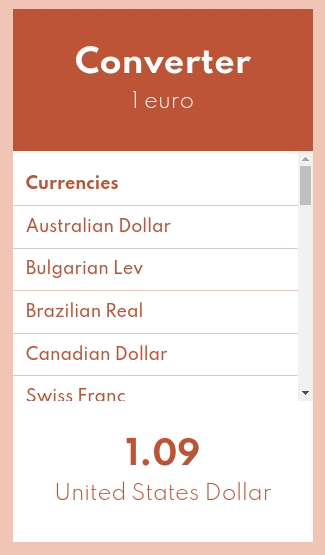

# Converter



## Objective

Deliver a component to convert euro in any currency you want.
You can choose the base amount to convert, you can see how much it represent at the end.

>Project developed using REACT in TypeScript, without any other library

### Project Installation

Install all necessary dependencies

```bash
pnpm install
```

Then run the script to start the "vite" server

```bash
pnpm run dev
```

## TODO project